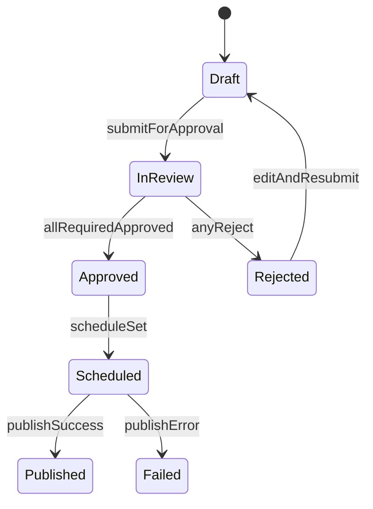
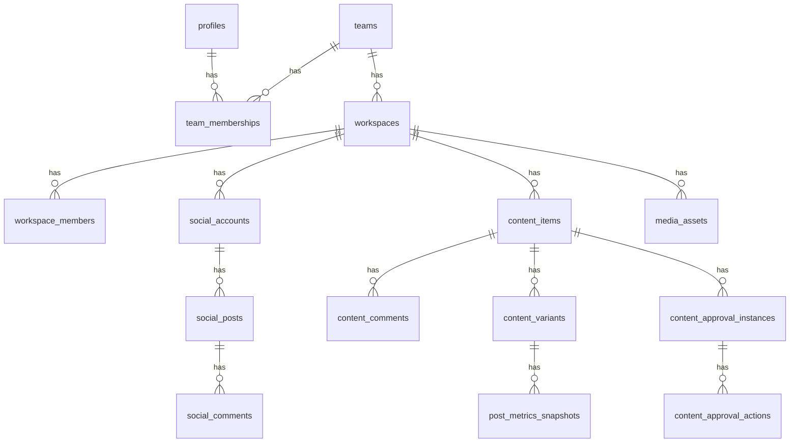
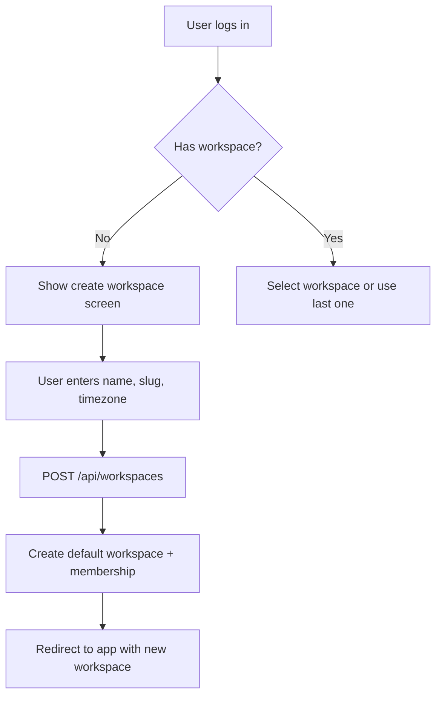
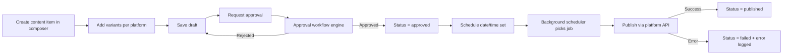
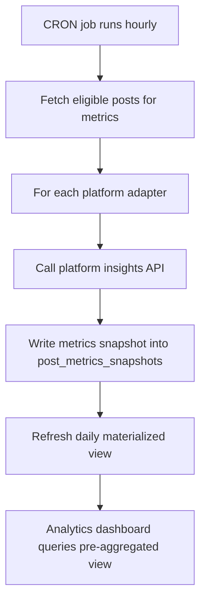
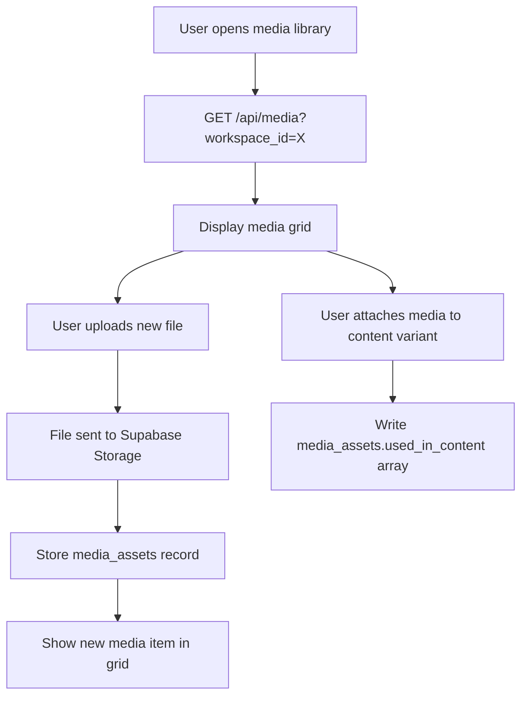

# Xocial – Complete Ground-Up Build Blueprint  
### (Planable-Style SaaS Platform, Fully Documented)

> This document is the unified, implementation-ready blueprint for building **Xocial**, an AI-native social media collaboration and scheduling platform inspired by Planable, but architected on **Next.js + Supabase + ShadCN + Vercel + Vercel AI Gateway**.  
> It merges and expands on the SRS foundations to cover **company, product, engineering, marketing, documentation, and execution** end‑to‑end.

---

## 0. Meta

## 🔧 Optimized Summary: Social Media Management Software Features

This section provides a concise, structured overview of all essential and advanced features expected from modern social media management platforms.

### **Core Features**
- Multi‑platform account management from one dashboard  
- Scheduling & auto‑publishing with optimal time suggestions  
- Visual content calendar (month/week/day)  
- Unified inbox for comments, messages & mentions  
- Collaboration: comments, mentions, internal/external threads  
- Content approvals (single‑step & multi‑step workflows)  
- Media library with tagging & reuse  
- Analytics dashboards & reporting  
- AI‑assisted captions, rewrites, hashtags, insights  
- Multi‑workspace or multi‑client management  
- Role-based access & permissions  
- Evergreen content recycling & rescheduling  
- **Engagement Predictor** – AI-powered post performance prediction based on current trends and cross-platform search keywords; advanced version analyzes follower activity patterns to predict engagement scores and follower interaction likelihood  
- **Workspace Concept** – Tab-based multi-account management system where each workspace represents a different user identity, enabling simultaneous login and management of multiple social media platforms (e.g., Workspace 1: vlogger's YouTube, Instagram, Facebook, Twitter, LinkedIn; Workspace 2: agency's review channels across all platforms)  
- **Platform-Specific Content Generation** – Intelligent content adaptation tool that generates platform-optimized content formats (Instagram Reels/Stories, YouTube long-form videos with descriptions, Facebook posts with hashtags/captions, Twitter threads, LinkedIn articles) based on platform-specific culture and requirements  

### **Advanced Features**
- Real-time monitoring & sentiment detection  
- AI-driven performance insights and recommendations  
- CRM & marketing integrations  
- Engagement prioritization  
- Automated workflows & reposting  
- Predictive analytics (best time, best format)  
- Enterprise security, SSO, auditing & compliance  


- **Product Name:** Xocial  
- **Category:** B2B/B2Team SaaS – Social Media Planning, Collaboration & Publishing  
- **Primary Users:** Social media teams at brands, agencies, multi-location businesses, and fast-growing creators  
- **Foundational SRS Reference:** “Xocial SRS.md” (technical spec for stack, pages, state machines, and schemas)  
- **Principle:** Every concept here is **implementable by a single technical founder** with limited support.

---

## 1. Company Blueprint (Ground-Up)

### 1.1 Mission, Vision, Values

#### Mission

> Help teams publish on social media with **zero chaos** – fast approvals, true-to-platform previews, and AI-assisted workflows all in one place.

#### Vision (5–10 years)

- Become the **default social planning layer** for brands, agencies, and emerging creators.
- Expand from social content to **multi-channel marketing collaboration** (email, blogs, ads, UGC).
- Be recognized as **the most usable collaboration layer** in the marketing stack, not just a scheduler.

#### Core Values

1. **Clarity over noise** – UI, workflows, notifications and analytics are designed for clarity, not data dumping.
2. **Opinionated but flexible** – Provide strong defaults while supporting complex agency/enterprise workflows.
3. **Velocity with safety** – Ship quickly, but guard against regressions with RLS, strict typing, and feature flags.
4. **AI as leverage, not gimmick** – AI reduces friction (copy, insights, summaries) but never blocks manual workflows.
5. **Founder empathy** – Features are prioritized based on ROI for small teams under real constraints.

---

### 1.2 Objectives

#### Short-Term (0–12 months)

- Ship **MVP + Stable v1**:
  - Multi-tenant workspaces, channels, content calendar, approvals, AI assistant, and basic analytics.
- Reach **20–50 paying teams** (agencies or brands) with **< 5% churn**.
- Validate pricing and positioning with real customers.

#### Mid-Term (12–36 months)

- Reach **500+ paying teams** with strong retention.
- Add **advanced analytics, engagement inbox**, and deeper collaboration.
- Build out self-serve onboarding and in-app adoption loops.
- Develop an **integrations ecosystem** (Slack, email, drive, project management tools).

#### Long-Term (36+ months)

- Become the **central hub** for content collaboration across channels.
- Offer **predictive & prescriptive AI** (what to post, when, where, and with which creative).
- Support custom enterprise workflows, SSO, data residency, and compliance (SOC2, ISO27001).

---

### 1.3 Target Market Definitions

#### Segments

1. **Solo & Small Teams (Tier 1)**
   - 1–3 users, managing 3–10 social profiles.
   - Need: Simple planning, AI assistance, and visual calendar.
   - Sensitivity: Price and time-to-value.

2. **Agencies (Tier 2)**
   - 3–50 users, multiple clients, multiple workspaces.
   - Need: Per-client workspaces, approvals, comments, multi-brand calendars, and reports.
   - Sensitivity: Seat & workspace pricing, collaboration features.

3. **Enterprise & Multi-location (Tier 3)**
   - 20–200+ users, many locations, strict approvals.
   - Need: Fine-grained roles/permissions, multi-step approvals, auditing, SSO, SLAs.
   - Sensitivity: Reliability, compliance, integrations.

#### ICP (Ideal Customer Profiles)

- **Marketing agencies** with 5–25 employees, handling 5–30 client brands.
- **In-house marketing teams** at DTC and SaaS companies with 3–15 people in content/social.
- **Franchise/multi-location brands** coordinating brand + local pages.

---

### 1.4 Founder Responsibilities (Two-Founders, One Developer)

Assume:
- **Founder A – Product & Engineering** (sole dev)
- **Founder B – GTM & Ops**

#### Founder A – Product & Engineering

- Technical architecture, coding, deployment, and monitoring.
- Supabase schema, RLS, migrations.
- Next.js app (app router), ShadCN UI implementation.
- AI Gateway integration & prompt design.
- DevOps: Vercel config, logs, performance, backups, error tracking.
- Internal tooling (admin panel, simple feature flags, seed scripts).

#### Founder B – GTM & Operations

- Positioning, messaging, pricing experiments.
- Customer discovery & interviews.
- Sales: demos, onboarding, renewals.
- Marketing: website copy, blog, social, partnerships.
- Support: help center content, email support, light success management.
- Finances: subscriptions, invoices, expenses monitoring.

#### Shared Responsibilities

- Product strategy & roadmap.
- Hiring decisions.
- Customer success & key account relationships.
- Legal basics: ToS, privacy, data processing agreements.

---

### 1.5 Team Roadmap

#### Stage 0 – Founders Only (0–12 months)

- Founder A: Full-stack + infrastructure.
- Founder B: GTM, support, low-code tools.

#### Stage 1 – First Hires (12–24 months, after ~30–50 customers)

1. **Customer Success / Support Specialist (Full time)**
   - Owns onboarding, support, help center updates.
   - Frees Founder B to focus on scalable growth.

2. **Full-Stack Engineer (Mid-level)**
   - Takes on modules like engagement inbox, analytics, and reporting.
   - Founder A remains architect & reviewer.

3. **Content/Marketing Specialist**
   - Scales blog, guides, templates, SEO.

#### Stage 2 – Scale-Up Team (24–48 months)

- **Engineering:**
  - 1–2 more full-stack engineers.
  - 1 infra/DevOps engineer (or fractional/consultant).
- **Product:**
  - 1 PM (initially part-time or fractional).
  - 1 Product Designer (shared across web app + marketing site).
- **GTM:**
  - 1 growth marketer.
  - 1–2 AE/Account Managers for larger deals.

---

## 2. Revenue Model & Billing Logic

### 2.1 Pricing Tiers

**Currency assumption:** INR/USD; billing via Razorpay.

| Plan       | Target Segment                | Price (Monthly) | Price (Yearly) | Users Included | Workspaces | Social Profiles | Key Features |
|-----------|--------------------------------|-----------------|----------------|----------------|-----------|-----------------|--------------|
| Free      | Solo creators, trial users     | $0              | –              | 1              | 1         | 3               | Basic calendar, AI-lite, single-step approvals |
| Pro       | Small teams, boutique agencies | $39 / workspace | $390 / year    | 3              | 1         | 10              | Full calendar, multi-channel, AI assistant, comments |
| Growth    | Agencies & in-house teams      | $99 / workspace | $990 / year    | 10             | 3         | 30              | Approvals, multi-workspace, analytics, engagement inbox basic |
| Enterprise| Large agencies & enterprises   | Custom          | Custom         | Unlimited      | Unlimited | Negotiated      | SSO, advanced approvals, SLAs, custom onboarding, custom data retention |

> Implementation detail: It’s simpler to attach **billing to workspace** rather than “account” for initial phases.

### 2.2 Usage & Seat Limits

- **Seats**:
  - Each plan includes a base number of **active members per workspace**.
  - Extra seats charged at **$10 / seat / month** for Pro & Growth.
- **Workspaces**:
  - Free: 1 workspace max.
  - Pro: 1 workspace per subscription.
  - Growth: Up to 3 workspaces; extra at $50/workspace/mo.
  - Enterprise: Negotiated.
- **Social Profiles / Channels**:
  - Hard limit at DB-level per workspace (for guardrails).
  - Free: 3 profiles.
  - Pro: 10 profiles.
  - Growth: 30 profiles.
  - Enterprise: configurable via feature flags.

### 2.3 Billing Logic

#### Razorpay Object Model

- **Customer** – maps to a **team / billing owner**.
- **Subscriptions** – one subscription per **billing plan**.
- **Subscription items** – supported via Razorpay Subscriptions API for addons.
- **Metering (future)** – optional usage-based billing.

#### Proration

- Use Razorpay’s **proration** logic or handle via custom billing cycles:
  - When upgrading (Free → Pro, Pro → Growth): Handle immediate upgrade via API.
  - When adding seats: Create new subscription or update existing quantity.
  - When removing seats: Schedule update for end of billing cycle.

#### Credits & Coupons

- **Coupons**:
  - Fixed amount off (e.g., $100 off).
  - Percentage off (e.g., 20% off first year).
- **Credits**:
  - Use **credits** system stored in Supabase for service credits (bug incidents, goodwill).
- **Logic**:
  - Coupons applied at checkout or via unique URL.
  - Credits applied automatically on next invoice.

#### Billing Edge Cases

- Failed payment:
  - Grace period: 7 days.
  - Dunning emails at day 1, 3, 7.
  - At day 7: downgrade workspace to “Read-only”:
    - No new scheduling.
    - No AI usage.
    - Existing scheduled posts remain until end of period.

- Downgrades:
  - Effective at end of billing period.
  - Validate limits:
    - If existing seats > new plan seats, all extra users set to “suspended”.
    - Show in-app banner to owner to manage users.

---

## 3. Web Application – Architecture & Implementation Plan

### 3.1 Tech Architecture Overview (Final Version)

- **Framework**: Next.js.
- **DB/Auth/Storage**: Supabase (Postgres + Auth + Storage + Edge Functions).
- **Hosting**: Vercel.
- **AI**: Vercel AI Gateway.
- **Design**: Shadcn + Tailwind.
- **Backups/Review**: GitHub.
- **Revenue/Billing**: Razorpay.

The SRS already specifies much of this; here we extend and finalize at system level.

---

### 3.2 High-Level System Diagram (Logical)

```mermaid
flowchart LR
  subgraph Client[Client (Browser)]
    UI[Next.js + ShadCN UI]
  end

  subgraph Vercel[Next.js App (Vercel)]
    API[API Routes /app/api/*]
    CRON[Vercel Cron Jobs]
  end

  subgraph Supabase[Supabase]
    DB[(PostgreSQL + RLS)]
    Auth[Auth & Sessions]
    Storage[(Object Storage)]
    Realtime[Realtime Channels]
    EdgeFunc[Edge Functions]
  end

  subgraph External
    SMAPIs[Social Media APIs (FB, IG, X, LI, TT)]
    Razorpay[Razorpay Billing]
    VAG[Vercel AI Gateway]
  end

  UI -->|HTTPS| API
  API -->|JWT| Auth
  API --> DB
  API --> Storage
  API --> Realtime
  API --> Razorpay
  API --> VAG
  CRON --> EdgeFunc
  EdgeFunc --> SMAPIs
  EdgeFunc --> DB
```

---

### 3.3 Access Control & Multitenancy

- **Tenant unit:** `team` (workspace owner) + `workspaces` inside team.
- **Auth:** Supabase Auth (email/password + magic link; OAuth later).
- **RLS policies**:
  - Every table references `team_id` and/or `workspace_id`.
  - RLS ensures users can see only data where they are members.
- **Role Model**:
  - `owner` → full rights, billing, manage roles.
  - `admin` → manage users and settings, not billing.
  - `manager` → manage content & approvals.
  - `creator` → create content, propose posts, request approvals.
  - `analyst` → read analytics only.

---

### 3.4 Error Handling

- Central `APIError` helper wrapping HTTP responses.
- React query or custom hooks use **retry with exponential backoff**.
- ShadCN `Toast` for user-facing error messages with actionable hints.
- Error boundaries at major page/feature boundaries (Calendar, Composer, Analytics).

---

### 3.5 CI/CD Workflow

- **Branching model:** `main` for production, feature branches for work-in-progress.
- **GitHub + Vercel**:
  - Every PR → preview deployment.
  - Automated linting, type-check, and tests on PR.
- Manual QA on preview for new features before merging to `main`.

---

### 3.6 Backup & Recovery

- **Supabase DB**:
  - Daily automatic backups.
  - Configuration: retain 30–90 days depending on plan.
- **Supabase Storage**:
  - Versioning for critical buckets (e.g., company logos, template content).
- **Configuration Backups**:
  - Export Supabase schema as SQL for infra-as-code reference.
- **Recovery Process (Playbook)**:
  1. Identify incident scope and time window.
  2. Check Supabase restore capabilities (time-based restore).
  3. Communicate downtime or partial restoration to customers.
  4. After restore, reconcile logs and replay jobs if needed.

---

## 4. Core Modules (Product & Engineering)

For each module:

- Objectives & problems solved  
- Data models  
- APIs  
- UX & UI logic  
- Edge cases  
- Dev implementation notes  
- Single-founder optimizations  

> Note: Some base schemas are defined in the SRS. Here we adapt & extend them into a more complete SaaS blueprint.

---

### 4.1 Workspaces & Channels

#### Objectives

- Provide logical grouping of brands/clients.
- Allow each workspace to connect multiple social media channels.
- Ensure strict data isolation between workspaces/teams.

#### Data Model (Core Tables)

1. **teams** – Company or agency entity.
2. **workspaces** – Brand or client-level container.
3. **workspace_members** – Membership + role within workspace.
4. **social_accounts** – Connected channels (IG, FB, etc.).

Example (extending SRS):

```sql
CREATE TABLE workspaces (
  id UUID PRIMARY KEY DEFAULT gen_random_uuid(),
  team_id UUID NOT NULL REFERENCES teams(id) ON DELETE CASCADE,
  name TEXT NOT NULL,
  slug TEXT NOT NULL,
  timezone TEXT NOT NULL DEFAULT 'UTC',
  color_theme TEXT DEFAULT 'teal',
  created_at TIMESTAMPTZ DEFAULT NOW(),
  updated_at TIMESTAMPTZ DEFAULT NOW(),
  UNIQUE(team_id, slug)
);

CREATE TABLE workspace_members (
  id UUID PRIMARY KEY DEFAULT gen_random_uuid(),
  workspace_id UUID NOT NULL REFERENCES workspaces(id) ON DELETE CASCADE,
  user_id UUID NOT NULL REFERENCES profiles(id) ON DELETE CASCADE,
  role TEXT NOT NULL CHECK (role IN ('owner', 'admin', 'manager', 'creator', 'analyst', 'guest')),
  created_at TIMESTAMPTZ DEFAULT NOW(),
  UNIQUE(workspace_id, user_id)
);
```

`social_accounts` remains as specified in the SRS, but with an added `workspace_id` for more granular isolation.

#### APIs

- `GET /api/workspaces` – list workspaces for current user.
- `POST /api/workspaces` – create workspace (owner/admin only).
- `GET /api/workspaces/{id}` – workspace details + channels summary.
- `GET /api/workspaces/{id}/channels` – list social_accounts constrained to workspace.
- `POST /api/workspaces/{id}/invite` – invite user by email.

#### UX & UI Logic

- Workspace selector in top navigation.
- If user has only one workspace, auto-select.
- If user has none, show “Create your first workspace” onboarding.

#### Edge Cases

- User removed from workspace while active: show immediate notice and redirect.
- Workspace deleted:
  - Mark as `deleted_at` and soft-delete references.
  - Disable scheduling jobs for associated posts.

#### Single-Founder Optimizations

- Start with **team = workspace** (no separate concept) to reduce complexity; introduce `workspaces` table when first multi-workspace customer appears.
- Use **simple invite flow** (email → magic link) via Supabase Auth.

---

### 4.2 User Roles & Permissions

#### Objectives

- Prevent unauthorized publishing or edits.
- Support agency/client collaboration (internal vs external).

#### Model

- Store **primary role** in `workspace_members.role`.
- Granular overrides in `permissions` JSONB (rarely used initially).

Example permission rules:

- Owner, Admin:
  - CRUD on workspace settings.
  - Manage billing (owner only).
- Manager:
  - CRUD on posts, manage approvals, view analytics.
- Creator:
  - CRUD on drafts, request approval, cannot publish without approval if workflow requires.
- Analyst:
  - Read-only access to analytics, calendar, and published posts.

#### Implementation Notes

- Use permission checks in Next.js API routes.
- For client-side, expose a derived `abilities` object for conditional UI (e.g., show/hide buttons).

---

### 4.3 Universal Content Composer

#### Objectives

- Single composer that can:
  - Draft content.
  - Target multiple channels (IG, FB, X, LI, TT).
  - Generate AI suggestions.
  - Attach media from media library.
  - Set schedule/unified publishing timestamp.

#### Data Model

- `content_items` – logical pieces of planned content.
- `content_variants` – per-platform adaptation.

```sql
CREATE TABLE content_items (
  id UUID PRIMARY KEY DEFAULT gen_random_uuid(),
  workspace_id UUID NOT NULL REFERENCES workspaces(id) ON DELETE CASCADE,
  title TEXT,
  brief TEXT,
  status TEXT NOT NULL CHECK (status IN ('draft', 'in_review', 'approved', 'scheduled', 'published', 'rejected')),
  scheduled_at TIMESTAMPTZ,
  created_by UUID NOT NULL REFERENCES profiles(id),
  created_at TIMESTAMPTZ DEFAULT NOW(),
  updated_at TIMESTAMPTZ DEFAULT NOW()
);

CREATE TABLE content_variants (
  id UUID PRIMARY KEY DEFAULT gen_random_uuid(),
  content_item_id UUID REFERENCES content_items(id) ON DELETE CASCADE,
  social_account_id UUID REFERENCES social_accounts(id) ON DELETE SET NULL,
  platform TEXT NOT NULL,
  caption TEXT,
  media_ids UUID[] , -- references media_library
  hashtags TEXT[],
  mentions TEXT[],
  link_url TEXT,
  platform_specific JSONB DEFAULT '{}', -- e.g. IG carousel settings
  status TEXT NOT NULL CHECK (status IN ('draft', 'ready', 'scheduled', 'published', 'failed')),
  scheduled_at TIMESTAMPTZ,
  published_at TIMESTAMPTZ,
  created_at TIMESTAMPTZ DEFAULT NOW(),
  updated_at TIMESTAMPTZ DEFAULT NOW()
);
```

#### API Sketch

- `POST /api/composer/items` – create content_item + variants.
- `PATCH /api/composer/items/{id}` – update.
- `POST /api/composer/items/{id}/ai-suggest` – AI caption/hashtag suggestions.
- `POST /api/composer/items/{id}/schedule` – finalize schedule (drives scheduling job).

#### UX & UI Logic

- Multi-column layout:
  - Left: Brief & strategy inputs (campaign, audience, tone).
  - Center: Editor with tabs per platform or unified view.
  - Right: Live previews (per platform) and scheduling.

- Character counters per platform with color-coded thresholds.

#### Edge Cases

- Different image aspect ratios required (IG vs FB).
- Link handling (IG feed vs X/LI).
- Platform-specific constraints (e.g., IG caption length, X character limit).

#### Single-Founder Optimizations

- Version 1: focus on **caption + single media** per platform.
- Add complex platform-specific features later: carousels, stories, threads.

---

### 4.4 Post Previews (Multi-Platform Fidelity)

- Render front-end components that **simulate each platform’s UI** (colors, fonts, placements) but are entirely custom.
- Use the same data from `content_variants` to render previews in composer, calendar, and approvals.

Key implementation detail:
- Keep preview components **pure and dumb**: they accept a strongly typed `PlatformPreviewProps` object and render accordingly.

---

### 4.5 Content Calendar (Month/Week/Day Views)

Reusing and extending the detailed calendar spec from the SRS, but tying it explicitly to `content_items` and `content_variants`.

#### Data

- UI uses a **denormalized view**:
  - A calendar query that returns, per day:
    - Count of content items.
    - Per-platform summary.
    - Status breakdown (draft/scheduled/published).

#### API

- `GET /api/calendar?workspace_id=X&from=YYYY-MM-DD&to=YYYY-MM-DD`.
- Returns an array grouped by date with aggregate counts & small post summaries.

---

### 4.6 Views: Feed, Grid, List

- **Feed View** – timeline of upcoming or recent posts, similar to native platforms.
- **Grid View** – especially for IG-style grid planning.
- **List View** – tabular, filterable view for operations teams.

All three views are different projections of the same `content_items + content_variants` dataset.

---

### 4.7 Collaboration (Comments, Mentions, Internal/External)

#### Objectives

- Enable discussion on each content item.
- Support **internal-only** comments vs **client-facing** threads.

#### Data Model

```sql
CREATE TABLE content_comments (
  id UUID PRIMARY KEY DEFAULT gen_random_uuid(),
  content_item_id UUID REFERENCES content_items(id) ON DELETE CASCADE,
  parent_id UUID REFERENCES content_comments(id) ON DELETE CASCADE,
  workspace_id UUID NOT NULL REFERENCES workspaces(id) ON DELETE CASCADE,
  author_id UUID NOT NULL REFERENCES profiles(id),
  body TEXT NOT NULL,
  visibility TEXT NOT NULL CHECK (visibility IN ('internal', 'external')),
  mentions UUID[] DEFAULT '{}', -- mentioned user IDs
  created_at TIMESTAMPTZ DEFAULT NOW(),
  updated_at TIMESTAMPTZ DEFAULT NOW()
);
```

#### UX & UI Logic

- Comments panel in a right-hand drawer or bottom sheet.
- Mentioning:
  - Type `@` to open an inline user search; on selection, mention tagged & notified.
- Internal vs External:
  - Toggle or label on each comment.
  - External comments visible to **external guests**; internal is hidden.

#### Edge Cases

- External collaborators may only see “external” comments.
- Deleting comments:
  - Creators can delete own comments within 5 minutes (“undo send” like behavior).
  - Admins can always delete.

---

### 4.8 Approval Workflows

#### Objectives

- Support:
  - Single-step approvals (one approver).
  - Multi-step sequential approvals.
  - Parallel approvals (any of N, or all of N).

#### Data Model

```sql
CREATE TABLE approval_workflows (
  id UUID PRIMARY KEY DEFAULT gen_random_uuid(),
  workspace_id UUID NOT NULL REFERENCES workspaces(id) ON DELETE CASCADE,
  name TEXT NOT NULL,
  description TEXT,
  type TEXT NOT NULL CHECK (type IN ('single_step', 'sequential', 'parallel')),
  is_default BOOLEAN DEFAULT FALSE,
  created_at TIMESTAMPTZ DEFAULT NOW()
);

CREATE TABLE approval_workflow_steps (
  id UUID PRIMARY KEY DEFAULT gen_random_uuid(),
  workflow_id UUID REFERENCES approval_workflows(id) ON DELETE CASCADE,
  step_order INT NOT NULL,
  required_role TEXT, -- optional; e.g. 'manager' or 'client'
  required_users UUID[], -- explicit approvers
  approval_rule TEXT NOT NULL CHECK (approval_rule IN ('any', 'all')), -- for parallel
  created_at TIMESTAMPTZ DEFAULT NOW()
);

CREATE TABLE content_approval_instances (
  id UUID PRIMARY KEY DEFAULT gen_random_uuid(),
  content_item_id UUID NOT NULL REFERENCES content_items(id) ON DELETE CASCADE,
  workflow_id UUID NOT NULL REFERENCES approval_workflows(id) ON DELETE CASCADE,
  current_step_id UUID REFERENCES approval_workflow_steps(id),
  status TEXT NOT NULL CHECK (status IN ('pending', 'approved', 'rejected', 'cancelled')),
  created_at TIMESTAMPTZ DEFAULT NOW(),
  updated_at TIMESTAMPTZ DEFAULT NOW()
);

CREATE TABLE content_approval_actions (
  id UUID PRIMARY KEY DEFAULT gen_random_uuid(),
  approval_instance_id UUID REFERENCES content_approval_instances(id) ON DELETE CASCADE,
  step_id UUID REFERENCES approval_workflow_steps(id) ON DELETE CASCADE,
  actor_id UUID REFERENCES profiles(id),
  action TEXT NOT NULL CHECK (action IN ('approve', 'reject', 'comment')),
  comment TEXT,
  created_at TIMESTAMPTZ DEFAULT NOW()
);
```

#### State Machine (Simplified)



---

### 4.9 Scheduling & Auto-Publishing

- Background job runner reads from `content_variants` where:
  - `status = 'scheduled'` AND `scheduled_at <= now() + X minutes`.
- Push-to-platform via Edge Functions:
  - Each platform gets a small adapter (`instagramPublisher`, `facebookPublisher`, etc).
- Error handling:
  - If platform API returns an error, mark variant as `failed`, store error message.
  - Optionally, auto-retry with a backoff strategy when rate limited.

---

### 4.10 Analytics & Reporting

#### Objectives

- Provide high-level and per-post insights.
- Use pre-aggregated metrics for performance.

#### Data

- The SRS already defines `post_metrics_snapshots` and `daily_metrics_summary` (materialized view).
- Xocial’s analytics dashboards query these pre-aggregated views.

#### Key Views

- **Overview Dashboard**:
  - KPIs: total posts, engagement rate, impressions, follower growth.
- **Per-Platform View**:
  - Filter by platform and account.
- **Content Performance**:
  - Ranking by engagement, saves, clicks.

#### AI Insights

- A scheduled job (e.g. daily) runs analytic summaries:
  - Calls Vercel AI Gateway with aggregated metrics.
  - Stores results in `ai_insights` table.

---

### 4.11 Media Library

#### Objectives

- Central repository of media assets per workspace.
- Tagging, search, filtering.

#### Data Model

```sql
CREATE TABLE media_assets (
  id UUID PRIMARY KEY DEFAULT gen_random_uuid(),
  workspace_id UUID NOT NULL REFERENCES workspaces(id) ON DELETE CASCADE,
  storage_path TEXT NOT NULL, -- Supabase storage path
  file_name TEXT NOT NULL,
  file_type TEXT NOT NULL,
  size_bytes BIGINT NOT NULL,
  width INT,
  height INT,
  tags TEXT[],
  uploaded_by UUID REFERENCES profiles(id),
  uploaded_at TIMESTAMPTZ DEFAULT NOW(),
  used_in_content UUID[] DEFAULT '{}'
);
```

---

### 4.12 Engagement Inbox (Basic)

#### Objectives

- Show comments and messages from connected channels.
- Support basic reply from within Xocial for supported platforms.

#### Approach

- Scheduled Edge Functions fetch latest comments/mentions.
- Store in `social_comments` (from SRS) enriched with workspace/account IDs.
- UI:
  - Filter by account, platform, sentiment, moderation status.
- For basic version:
  - Focus on Instagram/Facebook comments + X mentions.

---

### 4.13 AI Assistant

#### Capabilities

- Caption generation (per platform, tone).
- Rewriting (shorter, longer, more casual, more formal).
- Hashtag suggestions.
- Post-performance summary (“why did this post perform well/poorly?”).
- Calendar-level summary (“what worked this month?”).

#### Implementation

- AI endpoints under `/api/ai/…`.
- Use structured prompts and strongly typed JSON outputs.
- Rate limit usage per plan (free vs paid).

---

## 5. Public Marketing Website

### 5.1 Sitemap

Top-level:

- `/` – Home
- `/product/create`
- `/product/plan`
- `/product/approve`
- `/product/collaborate`
- `/product/schedule`
- `/product/analyze`
- `/solutions/brands`
- `/solutions/agencies`
- `/solutions/multi-location`
- `/pricing`
- `/blog`
- `/resources`
- `/resources/guides`
- `/resources/templates`
- `/resources/calculators`
- `/resources/quizzes`
- `/customers`
- `/start-program`
- `/support`
- `/login`
- `/signup`

---

### 5.2 Page-by-Page Content Architecture (High Level)

#### Home (`/`)

- **Hero:** Value proposition, primary CTA “Start free”, secondary CTA “Book demo”.
- **Social proof:** Logos of existing customers.
- **Product overview:** Sections for Create, Plan, Approve, Collaborate, Schedule, Analyze.
- **Use cases:** Brands, Agencies, Multi-location.
- **Testimonials:** Quotes, case studies.
- **Footer:** Links to docs, support, legal.

#### Product Pages

Each `/product/*` page:

- Anchor sections:
  - How it works (with small inline diagrams).
  - Key features.
  - Comparison vs spreadsheets/email.
  - Short demo video embed.
  - FAQ relevant to feature.
  - CTA to start trial or book demo.

#### Solutions Pages

Each `/solutions/*` page tailored to segment:

- Narrative of their current pain:
  - For agencies: feedback chaos, scattered approvals.
  - For brands: multi-stakeholder signoff, risk of off-brand posts.
- Concrete solution layout:
  - Workspaces per client.
  - Roles & permissions.
  - Approval workflows.

#### Pricing Page

- Toggle: **Monthly / Yearly**.
- Pricing cards (Free, Pro, Growth, Enterprise).
- FAQ about overages, seats, upgrades/downgrades.
- Small calculator of approximate cost based on #workspaces and seats.

---

### 5.3 SEO Plan

- **Core keywords:** “social media approval workflows”, “social media calendar tool”, “social media collaboration”, “plan social media content”.
- **Content types:**
  - Blog posts for TOFU.
  - Guides & templates for MOFU (content calendars, approval templates).
- **On-page:** unique title tags, meta descriptions, schema for FAQ & articles.
- **Technical:** fast load, clean URLs, no index for app sub paths.

---

### 5.4 Component-Level Structure Using ShadCN

Each marketing page uses:

- `NavigationMenu` for header.
- `Button` for CTAs.
- `Card` for feature highlights.
- `Accordion` for FAQs.
- `Tabs` for product feature toggles.
- `Carousel` (custom or third-party) for testimonials.

---

## 6. Documentation / Help Center

### 6.1 Information Architecture

Top-level categories:

1. **Getting Started**
   - Account creation
   - Connecting first workspace
   - Connecting channels
2. **Workspaces & Permissions**
3. **Content Creation & Calendar**
4. **Collaboration & Approvals**
5. **Scheduling & Publishing**
6. **Analytics & Reporting**
7. **Engagement Inbox**
8. **AI Assistant**
9. **Billing & Accounts**
10. **Security & Privacy**

### 6.2 Article Outline Example

Category: **Content Creation & Calendar**

- “Create your first post”
- “Multi-platform content variants”
- “Using the calendar”
- “View modes: calendar, feed, grid, list”
- “Rescheduling & drag-and-drop”

Each article structure:

- Problem statement.
- Step-by-step with screenshots (placeholders).
- Short “FAQ” section.
- Internal links to related articles (cross-linking for discovery and SEO).

---

### 6.3 Versioning System

- Store docs content in a `docs` table (or static MD files managed in repo).
- Each article has:
  - `version` (semantic).
  - `updated_at`.
  - `app_version_min` (for compatibility).

---

### 6.4 Integration with Web App

- In-app **“?” help icon** linking to relevant docs based on route.
- Contextual tooltips and inline help (ShadCN `Popover` or `HoverCard`).
- New feature announcements via small in-app toast + link to “What’s new.”

---

## 7. Engineering Execution Plan (Two-Founder Startup)

### 7.1 12-Month Roadmap

#### Q1 – MVP

- Workspaces & user auth.
- Channel connection & read-only import.
- Basic composer with simple calendar.
- Single-step approvals.
- AI caption generator v1.
- Very basic analytics (post-level metrics, totals).

#### Q2 – Stable v1

- Robust approvals.
- Multi-platform variants.
- Full calendar (month/week/day).
- Post previews.
- Media library.
- Razorpay billing integration.

#### Q3 – Analytics + Engagement

- Materialized views for analytics.
- Per-platform dashboards.
- AI insights.
- Engagement Inbox v1 (comments, mentions).

#### Q4 – Enterprise Features

- Advanced roles.
- Multi-workspace organizations.
- SSO (SAML, OAuth enterprise).
- Audit logs and activity feeds.
- SLAs & enterprise onboarding flows.

---

### 7.2 Founder Workload Optimization

- Use:
  - **ShadCN** for UI kit.
  - **Supabase** for auth, DB, storage, RLS.
  - **Razorpay** checkout & subscriptions.
- Avoid:
  - Building custom auth.
  - Building custom queue systems early.
  - Overly complex design systems; reuse ShadCN.

---

### 7.3 Risk Mitigation

- **Technical:**
  - Keep a small surface area for background jobs.
  - Avoid vendor lock-in where possible (encapsulate social API clients).
- **Security:**
  - Regularly rotate API keys.
  - Minimize data retention for PII.
- **Scalability:**
  - Use Supabase connection pooling and indexes.
- **Competitor parity:**
  - Focus on a few differentiators:
    - Best-in-class approvals.
    - Best-in-class AI assistance tightly integrated with workflow.
    - Easiest setup for agencies.

---

## 8. Database Schema (Condensed Overview)

> The SRS already provides a detailed schema for users, teams, accounts, posts, metrics, and more. This section gives a **high-level schema map** tying modules together.



---

## 9. API Documentation (Representative Overview)

> Full endpoint list would be generated from OpenAPI/TS definitions; below is a subset of important endpoints and patterns.

### 9.1 Authentication

Handled by Supabase Auth + Next.js middleware.

- `POST /api/auth/login`
- `POST /api/auth/logout`
- `POST /api/auth/magic-link` (optional)

### 9.2 Workspaces

- `GET /api/workspaces`
- `POST /api/workspaces`
- `GET /api/workspaces/{id}`
- `POST /api/workspaces/{id}/invite`

### 9.3 Composer

- `POST /api/composer/items`
- `GET /api/composer/items/{id}`
- `PATCH /api/composer/items/{id}`
- `POST /api/composer/items/{id}/ai-suggest`
- `POST /api/composer/items/{id}/request-approval`
- `POST /api/composer/items/{id}/schedule`

### 9.4 Calendar

- `GET /api/calendar`  
  Parameters:
  - `workspace_id`
  - `from`, `to`
  - `platform[]`

### 9.5 Analytics

- `GET /api/analytics/overview`
- `GET /api/analytics/platform`
- `GET /api/analytics/content`

### 9.6 Webhooks

- Razorpay:
  - `POST /api/webhooks/razorpay` – handle invoices, subscription changes, failed payments.
- Social platforms (future):
  - `POST /api/webhooks/facebook`
  - `POST /api/webhooks/instagram`
  - `POST /api/webhooks/twitter`

Each webhook:
- Validates signatures.
- Writes to minimal “events” table.
- Triggers internal processing job.

---

## 10. UI Component Inventory (ShadCN-Based)

Key components:

- **Layout:**
  - `AppShell` – sidebar + topnav.
  - `PageHeader`, `PageSection`.
- **Forms:**
  - `Form`, `Input`, `Textarea`, `Select`, `Combobox`, `Checkbox`, `Toggle`.
- **Cards:**
  - `MetricCard`, `AccountCard`, `PostCard`, `WorkspaceCard`.
- **Dialogs & Sheets:**
  - `Dialog` for confirmation & settings.
  - `Sheet` for side panels (comments, day details).
- **Calendars:**
  - `Calendar` component for date picking.
  - `DayCell` / `WeekRow` for calendar view.
- **Media:**
  - `MediaGrid`, `MediaThumbnail`, `UploadButton`.
- **Collaboration:**
  - `CommentList`, `CommentItem`, `MentionInput`.
- **Status & Feedback:**
  - `Badge` for statuses (draft, scheduled, published).
  - `Alert`, `Toast` for feedback.

---

## 11. End-to-End Flowcharts

### 11.1 Workspace Creation



### 11.2 Channel Linking

```mermaid
flowchart TD
  A[In workspace, Channels page] --> B[Click "Connect channel"]
  B --> C[Select platform]
  C --> D[Redirect to platform OAuth]
  D --> E[User approves access]
  E --> F[Callback: /api/auth/{platform}/callback]
  F --> G[Store encrypted tokens in DB]
  G --> H[Create social_account record]
  H --> I[Trigger initial sync job]
  I --> J[Update UI to show "syncing"]
  J --> K[When sync done, show "active" with metrics]
```

### 11.3 Content Creation → Approval → Scheduled → Published



### 11.4 Analytics Data Fetching



### 11.5 Media Library Flows



---

## 12. Closing Notes

This blueprint, together with the underlying SRS, provides:

- **Business foundation** (mission, pricing, team roadmap).
- **Product definition** (modules, workflows, UX).
- **Technical architecture** (Next.js + Supabase + Vercel + Vercel AI Gateway).
- **Database & API structure** for all core modules.
- **Documentation & go-to-market framing.**
- **Execution plan** for a single developer founder plus a GTM cofounder.

From here, the recommended next step is:

1. Implement DB schema & RLS in Supabase.  
2. Scaffold Next.js app shell with auth & basic routing.  
3. Implement **X (channels)**, then **O (calendar)**, then **C (composer)**, then **A (analytics)** following the component trees and flows.  
4. Add AI, approvals, and analytics as soon as the core creation/scheduling loop is stable.

This concludes the **Xocial – Complete Ground-Up Build Blueprint**.
